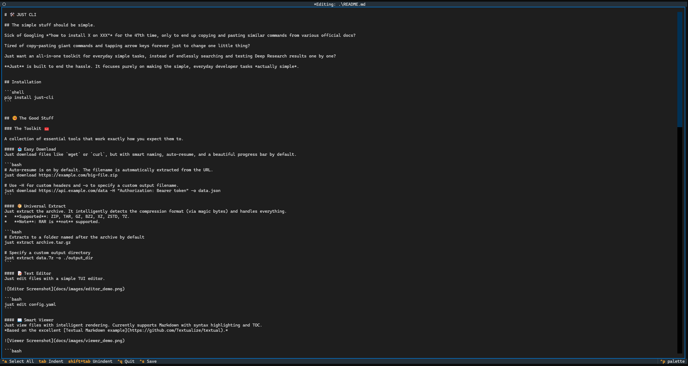
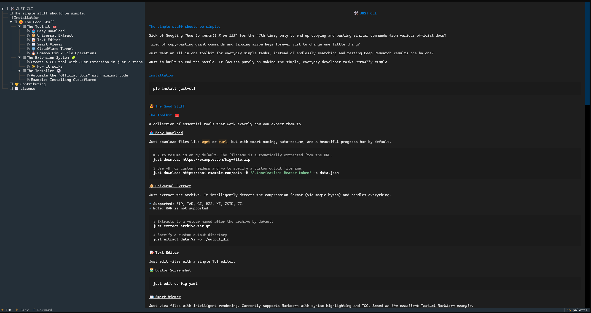

# 🛠️ JUST CLI

## The simple stuff should be simple.

Sick of Googling *"how to install X on XXX"* for the 47th time, only to end up copying and pasting similar commands from various official docs?

Tired of copy-pasting giant commands and tapping arrow keys forever just to change one little thing?

Just want an all-in-one toolkit for everyday simple tasks, instead of endlessly searching and testing Deep Research results one by one?

**Just** is built to end the hassle. It focuses purely on making the simple, everyday developer tasks *actually simple*.


## Installation

```shell
pip install just-cli
```

## 😋 The Good Stuff

### The Toolkit 🧰

A collection of essential tools that work exactly how you expect them to.

#### 📥 Easy Download
Just download files like `wget` or `curl`, but with smart naming, auto-resume, and a beautiful progress bar by default.

```bash
# Auto-resume is on by default. The filename is automatically extracted from the URL.
just download https://example.com/big-file.zip

# Use -H for custom headers and -o to specify a custom output filename.
just download https://api.example.com/data -H "Authorization: Bearer token" -o data.json
```

#### 📦 Universal Extract
Just extract the archive. It intelligently detects the compression format (via magic bytes) and handles everything.
*   **Supported**: ZIP, TAR, GZ, BZ2, XZ, ZSTD, 7Z.
*   **Note**: RAR is **not** supported.

```bash
# Extracts to a folder named after the archive by default
just extract archive.tar.gz

# Specify a custom output directory
just extract data.7z -o ./output_dir
```

#### 📝 Text Editor
Just edit files with a simple TUI editor.

```bash
just edit README.md
```



#### 📖 Smart Viewer
Just view files with intelligent rendering. Currently supports Markdown with syntax highlighting and TOC.
*Based on the excellent [Textual Markdown example](https://github.com/Textualize/textual).*

```bash
just view README.md
```



#### 🌐 Cloudflare Tunnel
Just expose your local server to the internet.

```bash
# Powered by Cloudflare Tunnel (cloudflared)
just tunnel http://localhost:8000
```

#### 🐧 Common Linux File Operations
Just some common file operations implemented in Python, for those tired of remembering command differences between Linux and Windows.

```bash
just cat
just ls 
just cp
just mv
just rm
just mkdir
```

### The Extension System 🧩

#### Create a CLI tool with Just Extension in just 2 steps

The core idea is simple: **String Replacement**. You take a long, complex command, mark the parts you want to change, and `just` generates a CLI for it.

Here is an example:

1.  **Register the complex command**:
    Tell `just` what command you want to alias.
    ```bash
    just ext add docker inspect -f '{{range .NetworkSettings.Networks}}{{.IPAddress}}{{end}}' f523e75ca4ef
    ```

2.  **Design your command**:
    Design a command structure that is easy for you to remember by marking dynamic parts using the syntax `[<name>:<type>=<default>#<help>]`.
    ```text
    # Replace the static container ID with a dynamic argument
    Enter extension commands: just docker ip f523e75ca4ef[container_id:str#The Container ID]
    ```

**That's it!** Now you can use your new command:
```bash
just docker ip <container_id>
```

#### ✨ How it works

When you run the command above, `just` compiles a native Python script using **typer**.

1.  **Parsing**: The syntax `f523e75ca4ef[container_id:str#The Container ID]` tells `just` to:
    *   Identify `f523e75ca4ef` as the **target string** to replace.
    *   Create a variable `container_id` of type `str`.
    *   Use "The Container ID" as the help message.

2.  **Code Generation**: It generates a Python function with a type-safe signature:
    ```python
    def main(container_id: Annotated[str, typer.Argument(help="The Container ID")]):
        # The original command template
        command = "docker inspect -f '{{range .NetworkSettings.Networks}}{{.IPAddress}}{{end}}' f523e75ca4ef"
        
        # String Replacement Logic
        command = command.replace('f523e75ca4ef', str(container_id))
        
        # Execution
        subprocess.run(shlex.split(command))
    ```

3.  **Result**: You get a fully functional CLI with auto-completion, type validation, and help messages—all powered by the simple act of string replacement.


### The Installer 💿

#### Automate the "Official Docs" with minimal code.

`just` allows you to run any command from the official docs using `just.execute_commands`. It simply automates your manual steps.

To help you make decisions, `just` provides system probing tools:
*   `just.system.platform`: `linux`, `windows`, `darwin`
*   `just.system.arch`: `x86_64`, `aarch64`
*   `just.system.pms`: Detects `winget`, `brew`, `apt`, etc.

We also provide two specialized helpers for common scenarios:
*   **`just.BinaryInstaller`**: Best for single-file binaries (handles download, chmod, path).
*   **`just.SimpleReleaseInstaller`**: Best for archives (handles download, extraction, linking).

#### Example: Installing Cloudflared

Here is a complete example that mimics the official installation logic:

```python
@just.installer(check="cloudflared --version")
def install_cloudflare():
    """Install Cloudflare Tunnel client."""
    
    # Use standard package managers if available
    if just.system.pms.winget.is_available():
        just.execute_commands("winget install --id Cloudflare.cloudflared")
        
    elif just.system.pms.brew.is_available():
        just.execute_commands("brew install cloudflared")
    
    # Use BinaryInstaller
    elif just.system.platform == 'linux':
        # This helper automates: curl -> chmod +x -> symlink to bin
        just.BinaryInstaller(
            url='https://github.com/cloudflare/cloudflared/releases/.../cloudflared-linux-amd64',
            alias='cloudflared'
        ).run()
    
    else:
        raise NotImplementedError
```


## 🤝 Contributing

Found a bug? Want to add a new installer?
Fork it, fix it, ship it. We love PRs.
Just keep it cool, keep it simple, and don't break the "just works" vibe.

## 📄 License

MIT. Go wild.
