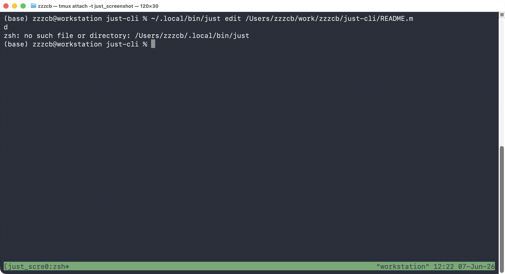
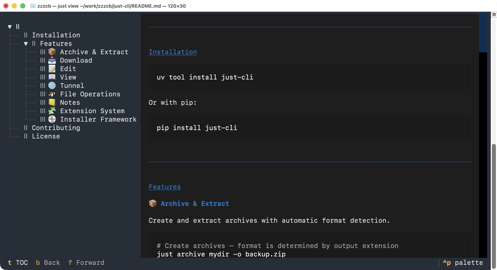

<h1 align="center">🛠️ JUST CLI</h1>

<p align="center"><strong>The simple stuff should be simple.</strong></p>

<p align="center">
<a href="https://pypi.org/project/just-cli/"> </a>
<a href="https://pypi.org/project/just-cli/"> </a>

</p>

<p align="center">
Tired of Googling "how to install X" for the 47th time, just to end up copy-pasting from official docs?
</p>
<p align="center">
Tired of copy-pasting giant commands every time, just to change one little parameter?
</p>
<p align="center">
Start using <b>Just</b> — an all-in-one CLI toolkit that makes everyday developer tasks <i>actually simple</i>.
</p>

---

## Installation

```bash
uv tool install just-cli
```

Or with pip:

```bash
pip install just-cli
```

---

## Features

### 📦 Archive & Extract

Create and extract archives with automatic format detection.

```bash
# Create archives — format is determined by output extension
just archive mydir -o backup.zip
just archive mydir -o backup.tar.gz
just archive mydir -o backup.7z
just archive myfile.txt -o myfile.txt.gz    # single-file compression

# Extract archives — magic bytes detection, works even with wrong extensions
just extract backup.zip
just extract data.tar.gz -o ./output_dir
```

<details>
<summary><strong>Supported formats</strong></summary>

| Format | Archive | Extract |
|--------|:-------:|:-------:|
| `.zip` | ✅ | ✅ |
| `.tar` | ✅ | ✅ |
| `.tar.gz` / `.tgz` | ✅ | ✅ |
| `.tar.bz2` / `.tbz2` | ✅ | ✅ |
| `.tar.xz` / `.txz` | ✅ | ✅ |
| `.tar.zst` / `.tzst` | ✅ | ✅ |
| `.gz` | ✅ | ✅ |
| `.bz2` | ✅ | ✅ |
| `.xz` | ✅ | ✅ |
| `.zst` | ✅ | ✅ |
| `.7z` | ✅ | ✅ |

</details>

### 📥 Download

Like `wget` or `curl`, but with auto-resume **by default** and a progress bar.

```bash
# Filename is automatically extracted from URL, resume is on by default
just download https://example.com/big-file.zip

# Custom headers and output name
just download https://api.example.com/data -H "Authorization: Bearer token" -o data.json
```

### 📝 Edit

A lightweight TUI text editor built right in.

```bash
just edit README.md
```



### 📖 View

Smart file viewer with syntax highlighting, TOC, and structured rendering.

```bash
just view README.md          # Markdown
just view data.json          # JSON
just view config.xml         # XML
```



### 🌐 Tunnel

Expose your local server to the internet via Cloudflare Tunnel.

```bash
just tunnel http://localhost:8000
```

### 🐧 File Operations

Common file commands, cross-platform, no syntax surprises.

```bash
just cat file.txt
just ls
just cp src dst
just mv old new
just rm file
just mkdir dir
```

### 📒 Notes

Quick notes stored in `~/.just/notes`.

```bash
just note
```

### 🧩 Extension System

Turn any long command into a reusable, type-safe CLI in 2 steps.

**1. Register the base command:**
```bash
just ext add docker inspect -f '{{range .NetworkSettings.Networks}}{{.IPAddress}}{{end}}' f523e75ca4ef
```

**2. Define your CLI by marking dynamic parts:**
```text
Enter extension commands: just docker ip f523e75ca4ef[container_id:str#The Container ID]
```

**Done.** Now use it:
```bash
just docker ip <container_id>
```

Under the hood, `just` generates a native Python script using typer — with auto-completion, type validation, and help messages. All from simple **string replacement**.

### 💿 Installer Framework

Automate installation scripts with system probing and binary/archive helpers.

```python
@just.installer(check="cloudflared --version")
def install_cloudflared():
    if just.system.pms.brew.is_available():
        just.execute_commands("brew install cloudflared")
    elif just.system.platform == 'linux':
        just.BinaryInstaller(
            url='https://github.com/cloudflare/cloudflared/releases/.../cloudflared-linux-amd64',
            alias='cloudflared'
        ).run()
```

Built-in system info:
- `just.system.platform` → `linux`, `windows`, `darwin`
- `just.system.arch` → `x86_64`, `aarch64`
- `just.system.pms` → detects `winget`, `brew`, `apt`, etc.

---

## Contributing

Found a bug? Want a new feature?
Fork it, fix it, ship it. Keep it cool, keep it simple, don't break the *"just works"* vibe.

## License

[MIT](LICENSE)
